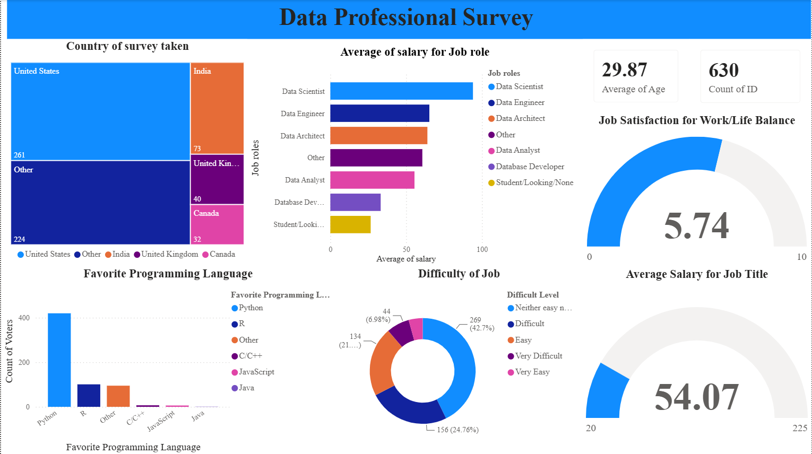

# 📊 Data Professional Survey Analysis — Power BI

## 📌 Project Overview

This project presents an interactive **Power BI dashboard** built to analyze survey responses from data professionals.

The dashboard explores **job roles, salary levels, programming language preferences, geographic distribution, work-life balance, job satisfaction, and the perceived difficulty of entering the data field**.

The project demonstrates practical skills in **data visualization, dashboard development, data analysis, and communicating insights through Power BI**.

---

## 🖼️ Dashboard Preview



---

## 🎯 Project Objectives

* Analyze the demographic profile of survey respondents.
* Compare average salary across different data-related job roles.
* Identify the most preferred programming languages.
* Analyze survey participation across different countries.
* Understand work-life balance and job satisfaction.
* Examine how difficult respondents perceive entering the data field to be.
* Present the findings through an interactive and easy-to-understand dashboard.

---

## 🛠️ Tools & Technologies

* **Microsoft Power BI**
* **Power Query**
* **Data Cleaning & Transformation**
* **Data Visualization**
* **Dashboard Design**
* **Data Analysis**

---

## 📊 Dashboard Overview

The dashboard contains several visualizations and KPI cards covering:

### 👥 Survey & Demographics

* Total survey respondents
* Average age of respondents
* Country-wise distribution of survey participants

### 💰 Salary Analysis

* Average salary by job role
* Overall average salary
* Comparison of salary levels across different data professions

### 💻 Programming Preferences

* Favorite programming languages among respondents
* Comparison of programming language popularity

### 😊 Job Satisfaction & Work-Life Balance

* Work-life balance satisfaction score
* Job satisfaction analysis

### 🎯 Career Entry Difficulty

* Perceived difficulty of entering the data field
* Distribution of responses across difficulty levels

---

## 🔍 Key Dashboard Insights

Based on the dashboard analysis:

* The dataset contains **630 survey respondents**.
* The average age of respondents is approximately **29.87 years**.
* The **United States** represents the largest country group in the survey.
* **Python** is the most frequently selected favorite programming language among respondents.
* **Data Scientist** has the highest average salary among the job roles displayed in the dashboard.
* The dashboard shows variation in perceived difficulty when entering the data field, with a substantial proportion of respondents selecting a neutral difficulty level.
* The overall work-life balance satisfaction score displayed on the dashboard is approximately **5.74/10**.
* The dashboard provides a visual comparison of salary, job role, programming preferences, and career-entry experiences.

---

## 📁 Repository Contents

```text
Data-Professional-Survey-PowerBI/
│
├── Data_Professional_Survey_PowerBI.pbix
├── Data_Professional_Survey_Dashboard.png
└── README.md
```

### Files

**`Data_Professional_Survey_PowerBI.pbix`**
The Power BI report containing the dashboard, visualizations, data model, and analysis.

**`Data_Professional_Survey_Dashboard.png`**
A static preview of the completed Power BI dashboard.

---

## 📚 Learning Reference

This project was completed as a **hands-on Power BI learning project based on a tutorial by Alex The Analyst**.

The tutorial was used as a learning reference to practice Power BI concepts including data preparation, visualization, dashboard design, and analytical storytelling.

The project is included in this portfolio to demonstrate my **hands-on learning and practical experience with Power BI**.

---

## 💡 Skills Demonstrated

* Data Analysis
* Data Visualization
* Power BI Dashboard Development
* Power Query
* Data Cleaning & Transformation
* KPI Development
* Business-oriented Analysis
* Analytical Storytelling
* Dashboard Design

---

## 🚀 Learning Outcome

Through this project, I gained practical experience in transforming survey data into an interactive analytical dashboard and communicating patterns and insights through visualizations.

This project is part of my ongoing journey toward becoming a **Data Analyst**, with a focus on developing practical skills in **Power BI, Python, SQL, Excel, and data analytics**.
****
